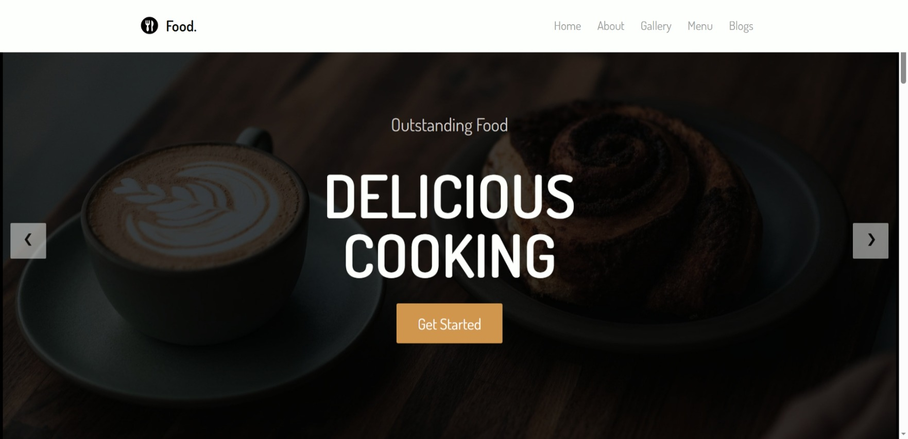

# Responsive food Website 🌐

A simple, responsive food website built with pure HTML and CSS.  
The site includes a hero section, about section, projects showcase, and contact area.  
Designed to be clean, minimal, and easy to customize for personal branding.

## ✨ Features

- Responsive layout for desktop, tablet, and mobile
- Clean and modern design using only HTML and CSS
- Navigation bar with smooth scrolling between sections
- Hero section with main headline and call-to-action

## 🚀 Live Demo

You can view the website here:  
(https://meiscorp.github.io/food_website/)

## 🛠️ Technologies Used

- **HTML5** – structure and content
- **CSS3** – layout, styling, and responsiveness
- **Google Fonts** – custom typography

📸 Screenshot

